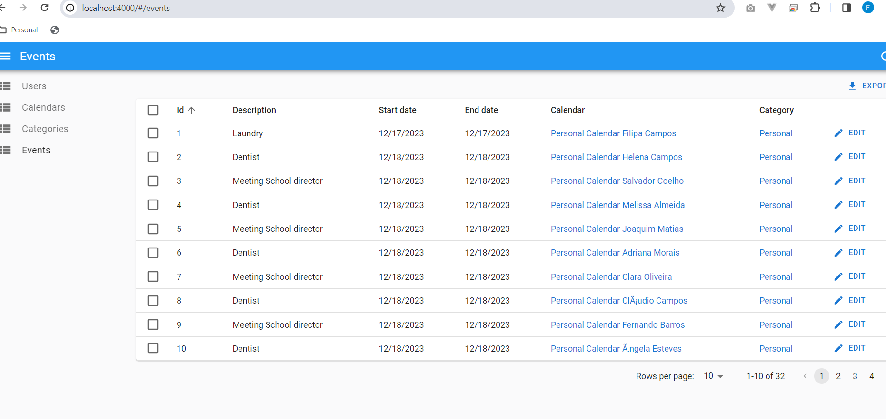
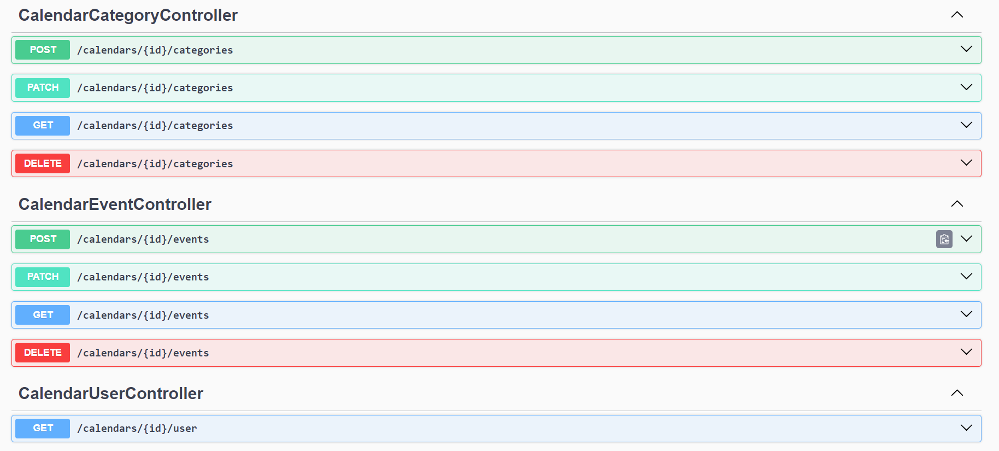

# C3 : Product

## 3.1 Development

After deciding on the theme, the product development was executed in the following way:

1. Install the LoopBack 4 globally on the system:

``` 
npm i -g @loopback/cli
```

2. Create the LoopBack 4 application 


3. Then we've started with the model creation, here is an example of the user model.


4. Next, We've configured the database connection


5. Added the repositories


6. And finally the relations


7. The API was tested locally using postman 


8. After this part we've started investigating the react-admin project and we were able to include a very basic working version of it:



9. When we were reaching the end of the developments, we've started the configuration of the environment using docker. 

To run the 3 parts of the applications we've used docker-compose:


10. We also have the OpenAPI Spec generated by loopback 4



## 3.2 Installation

The installation process is very easy due to the use of docker. The only thing we need to install in the machine is 'Docker for Desktop'.

After the installation, we just need to open a terminal and on the setup folder execute:

```
docker-compose up
```  

## 3.3 Usage

No special notes in this section.

## 3.4 Implementation details

No special notes in this section.


---
[< Previous](c2.md) | [^ Main](../../../) | [Next >](c4.md)
:--- | :---: | ---: 